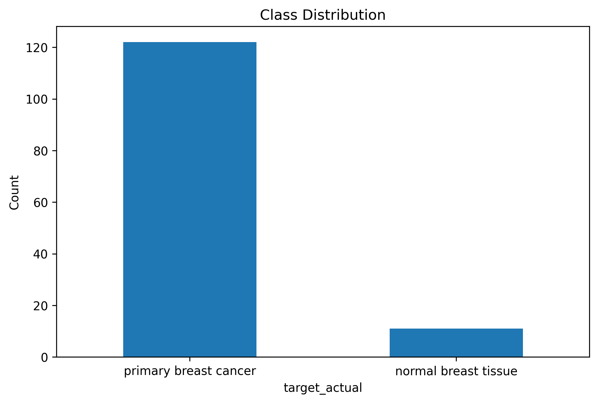
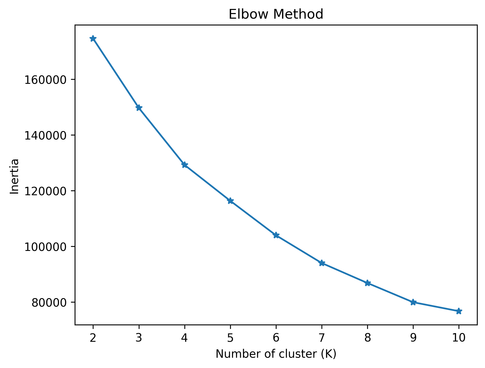
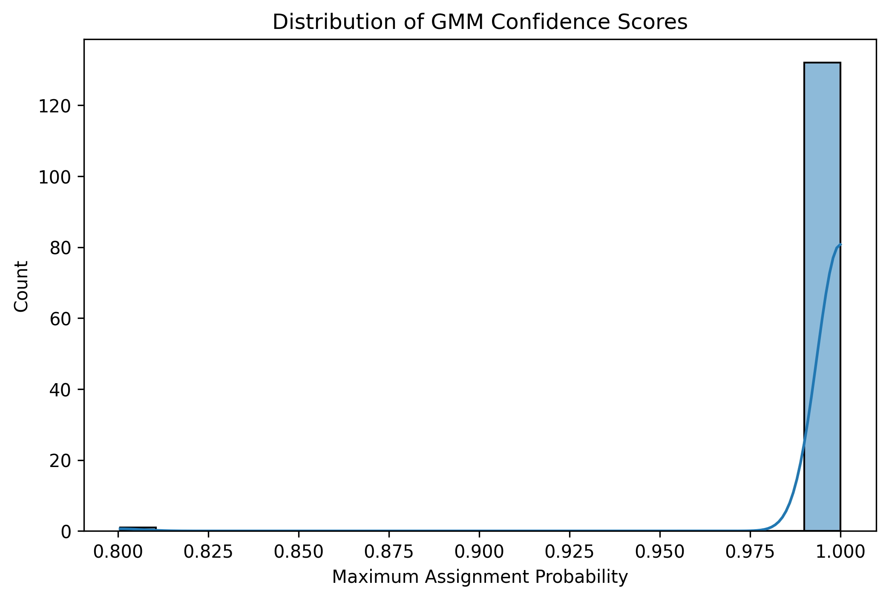
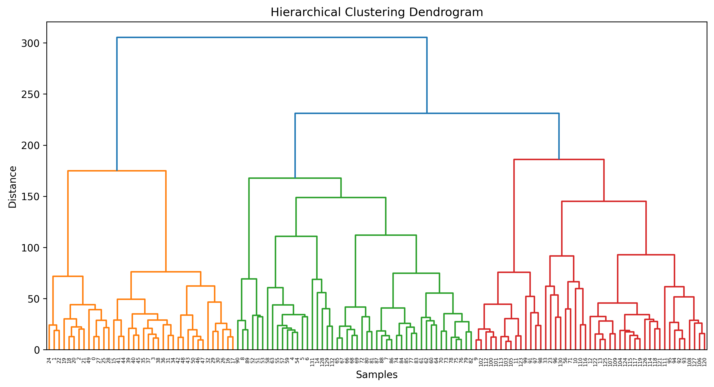
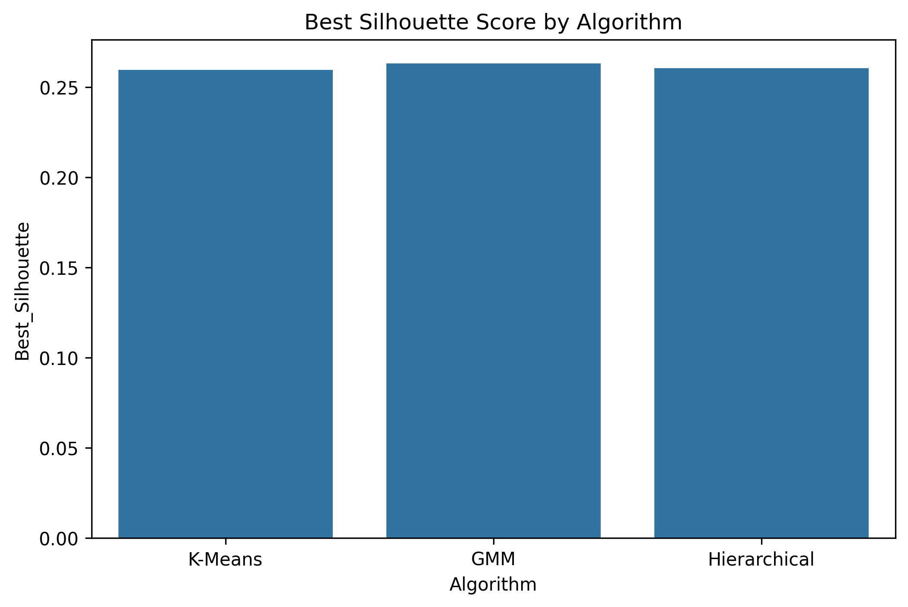

# Investigating Natural Cluster Formation in miRNA Expression Data Through PCA and Unsupervised Learning

## Overview

High-dimensional biological datasets often contain hidden structures that are difficult to identify using traditional analysis methods. This project investigates whether **natural clusters emerge within breast cancer miRNA expression data** after dimensionality reduction using Principal Component Analysis (PCA).

The study applies and compares three unsupervised learning algorithms:

* K-Means Clustering
* Gaussian Mixture Models (GMM)
* Hierarchical Clustering

The goal is not classification, but exploration of the intrinsic structure of the data and evaluation of whether biologically meaningful subgroups arise naturally.

---

## Dataset

**Dataset:** GSE58606 miRNA Expression Dataset

| Feature           | Value                                       |
| ----------------- | ------------------------------------------- |
| Samples           | 133                                         |
| Original Features | 1926 miRNAs                                 |
| Classes           | Normal Breast Tissue, Primary Breast Cancer |
| Normal Samples    | 11                                          |
| Cancer Samples    | 122                                         |

---

## Project Workflow

```text
Raw miRNA Expression Data
            ↓
Exploratory Data Analysis
            ↓
Data Standardization
            ↓
Principal Component Analysis (PCA)
            ↓
K-Means Clustering
Gaussian Mixture Models
Hierarchical Clustering
            ↓
Performance Comparison
            ↓
Biological Interpretation
```

---

## Exploratory Data Analysis

### Class Distribution



The dataset is highly imbalanced, with primary breast cancer samples greatly outnumbering normal breast tissue samples.

---

## Dimensionality Reduction Using PCA

The original dataset contains 1926 features, making clustering computationally expensive and difficult to visualize.

PCA was applied to reduce dimensionality while retaining most of the information contained within the dataset.

### PCA Visualization

.png)

### PCA Summary

| Metric                        | Value |
| ----------------------------- | ----- |
| Original Features             | 1926  |
| Principal Components Retained | 32    |
| Variance Preserved            | ~90%  |

PCA reduced the feature space by more than 98% while preserving the majority of the dataset variance.

---

## K-Means Clustering

### Elbow Method



### Results

* Best Number of Clusters: **6**
* Best Silhouette Score: **0.260**

K-Means suggested that the data contains substantially more structure than a simple cancer-versus-normal separation.

---

## Gaussian Mixture Models (GMM)

Unlike K-Means, GMM performs soft clustering by assigning probabilities of membership.

### Confidence Distribution



### Results

| Metric                     | Value  |
| -------------------------- | ------ |
| Best Components            | 6      |
| Best Silhouette Score      | 0.263  |
| Mean Assignment Confidence | 0.9985 |

Additional model-selection metrics:

| Metric | Preferred Components |
| ------ | -------------------- |
| AIC    | 9                    |
| BIC    | 8                    |

Most samples were assigned to clusters with extremely high confidence, indicating well-defined cluster memberships.

---

## Hierarchical Clustering

Hierarchical clustering was performed using Ward linkage.

### Dendrogram



### Results

* Best Number of Clusters: **10**
* Best Silhouette Score: **0.261**

The dendrogram revealed nested structures and additional subgroup relationships within the cancer samples.

---

## Algorithm Comparison

### Best Silhouette Scores


### Silhouette Score Trends

.png)
### Performance Summary

| Algorithm    | Best K | Best Silhouette |
| ------------ | -----: | --------------: |
| K-Means      |      6 |           0.260 |
| GMM          |      6 |       **0.263** |
| Hierarchical |     10 |           0.261 |

---

## Key Findings

### 1. Normal Tissue Samples Form a Consistent Group

All clustering algorithms grouped normal breast tissue samples together, indicating strong similarity among healthy samples.

### 2. Cancer Samples Are Heterogeneous

Cancer samples consistently split into multiple clusters across all algorithms, suggesting the presence of distinct molecular subgroups.

### 3. More Than Two Clusters Exist

Optimal clustering solutions required significantly more than two clusters, indicating structure beyond a simple cancer-versus-normal separation.

### 4. Similar Performance Across Algorithms

All three clustering methods achieved comparable silhouette scores, suggesting that the observed structure is robust rather than algorithm-specific.

### 5. GMM Provided the Most Informative Clustering

Although performance differences were small, GMM achieved the highest silhouette score and additionally provided probabilistic cluster assignments.

---

## Technologies Used

* Python
* Pandas
* NumPy
* Matplotlib
* Seaborn
* Scikit-learn
* SciPy

---

## Project Structure

```text
project/
│
├── data/
│
├── notebooks/
│   ├── EDA_PCA.ipynb
│   ├── KMeans.ipynb
│   ├── MM.ipynb
│   ├── Hierarchi_Clustering.ipynb
│   └── Comparison.ipynb
│
├── screenshots/
│
└── README.md
```

---

## Future Work

Potential extensions of this project include:

* Supervised classification of cancer versus normal tissue
* Feature importance analysis
* miRNA biomarker discovery
* Cluster validation using biological annotations
* Deep learning approaches for genomic data analysis

---

## Conclusion

This project demonstrates how dimensionality reduction and unsupervised learning can be used to explore high-dimensional genomic datasets.

By reducing 1926 miRNA features to 32 principal components and applying multiple clustering techniques, the analysis revealed substantial heterogeneity among breast cancer samples. The results suggest that meaningful subgroup structure exists within the dataset and highlight the usefulness of unsupervised learning for exploratory bioinformatics research.
